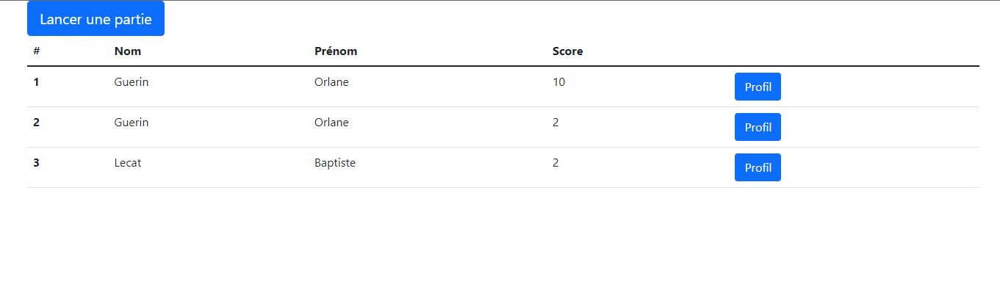
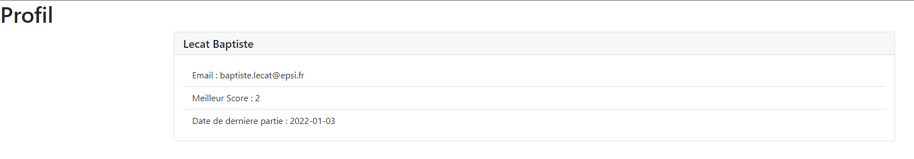
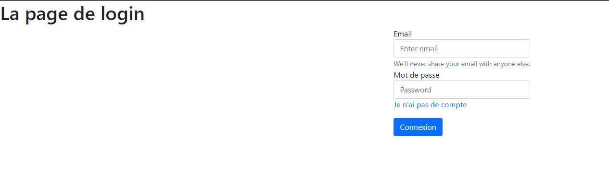
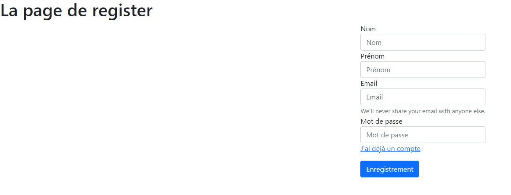
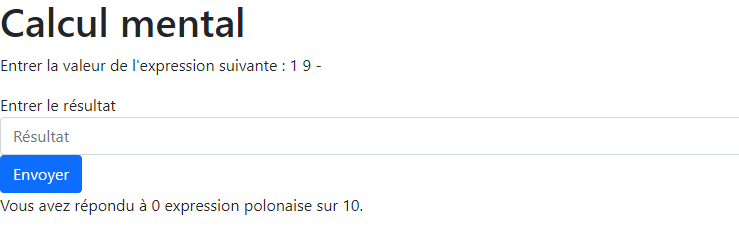

# PolishExpression

Projet réalisé par Baptiste Lecat - François-Xavier Pelet - Marty Bertrand.

## Fonctionnalités

- Se connecter.
- S'enregistrer.
- Visualiser le classement global (20 premieres personnes).
- Voir le profil d'un utilisateur.
- Jouer au jeux des expressions polonaise.

### Routes

- GET / POST - Connexion - /login
- GET / POST - Enregistrement - /register
- GET - Accueil - /home
- GET - Profil d'un joueur - /profil?userId=unUserId
- GET / POST - Jouer - /play

### Images

Page d'accueil

Page de profil

Page de Login

Page de Register

Page de Jeux

### Sécurité

Pour accéder au pages du site il est nécessaire d'être authentifier, pour ce faire chaque controller dispose d'une fonction : isAuthenticated

    private boolean isAuthenticated(HttpServletRequest req){
        boolean isAuthenticated = false;
        int idUser = 0;
        HttpSession session = req.getSession();
        try {
            idUser = Integer.parseInt(session.getAttribute("idUser").toString());
            Auth authRepository = new Auth();
            User user = authRepository.whoAmI(idUser);
            isAuthenticated = true;
            System.out.println(authRepository.whoAmI(idUser));

        } catch (Exception e) {
            return false;
        }
        return isAuthenticated;
    }

L'ensemble des requêtes SQL sont préparées pour limiter les risques d'injections SQL.
Les mots de passes sont hasher en SHA256.

### Note :
La connection base de donnée n'est pas possible en distant avec la configuration actuelle de TomCat.
C'est pourquoi vous trouverez à la racine un fichier SQL contenant le script de la base de données.
Si nécessaire il est possible de modifier les identifiants de connection dans le fichier Connector du dossier Database.
 
